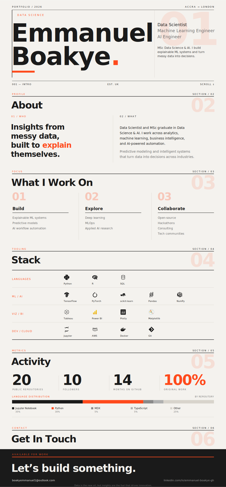

<!--
  PROFILE README — Emmanuel Boakye (@ChurchillonData)
  The main page is ONE seamless SVG (assets/profile.svg) — edit that file to restyle.
  Accent colour = #FF4A1C. Logos are embedded (no external image requests).
  The stats card and badges below are separate because they are live services /
  clickable links, which a single SVG can't host on GitHub.
-->

  

  
  &nbsp;
  
  &nbsp;
  

