<!--
  ┌──────────────────────────────────────────────────────────────┐
  │  PROFILE README — Emmanuel Boakye (@ChurchillonData)           │
  │  Swiss / editorial design system. All graphics are SVG files   │
  │  in /assets with logos inlined (no external image requests).   │
  │  To restyle: edit the SVGs. Accent colour = #FF4A1C.           │
  │  Stats cards (Activity section) are live third-party services. │
  └──────────────────────────────────────────────────────────────┘
-->

<!-- ========================= HERO ========================= -->
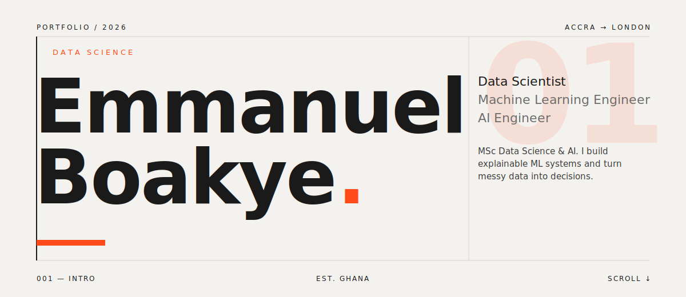

  
  
  

<!-- ========================= ABOUT ========================= -->
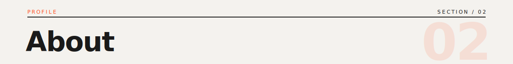
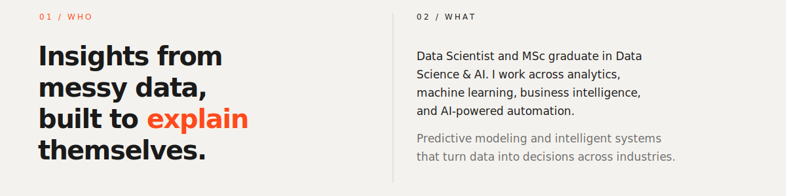

<!-- ========================= FOCUS ========================= -->
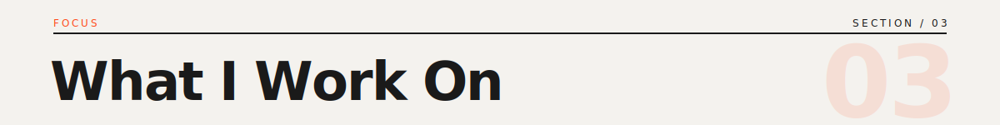
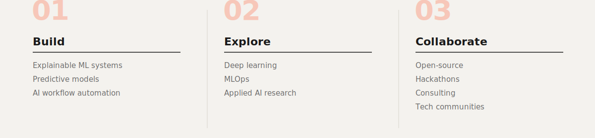

<!-- ========================= STACK ========================= -->
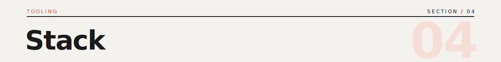
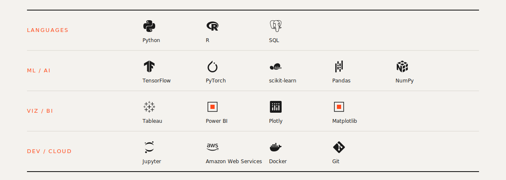

<!-- ========================= ACTIVITY (live stats) ========================= -->
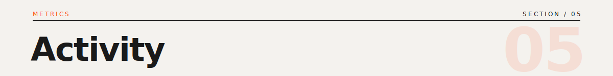

  
  &nbsp;
  

<!--
  NOTE on the Activity cards above: these are a third-party service
  (github-readme-stats) with a light background (#F4F2EE) chosen to match
  the editorial paper. They look intentional in GitHub light mode. If you
  primarily use dark mode and want them to blend, change bg_color to 0D1117
  and the text_color values to E6E1D7. To drop live stats entirely, delete
  this whole block — the section header above can be removed too.
-->

<!-- ========================= SELECTED WORK ========================= -->
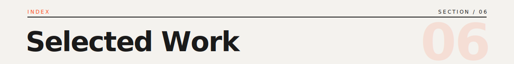
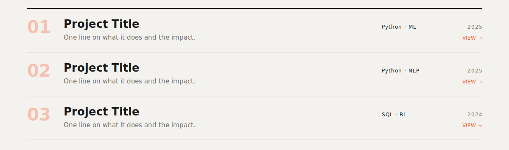

<!--
  The work index art above is a TEMPLATE with placeholder rows. To make it
  real, edit /assets/work.svg — each row has: number, title, one-line
  description, tag string, and year. Replace "Project Title" etc. with your
  actual repos (e.g. GreenLens). The art is static, so clicking it won't
  link out; if you want clickable repo links, add a Markdown list right here
  under the image, like:

  - **GreenLens** — greenwashing detection across 10 oil & gas majors · `Python · NLP` · [repo →](LINK)
-->

<!-- ========================= CONTACT ========================= -->
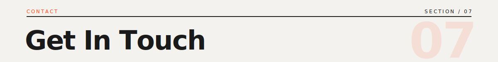
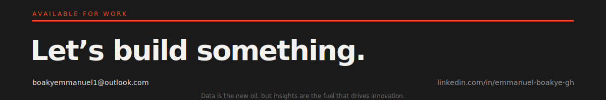
